# Infrastructure Architecture Documentation
## PGAGI DevOps Assignment — Pravardhan Reddy

---

## 1. Cloud & Region Selection

### AWS — `ap-south-1` (Mumbai)
**Justification:**
- Lowest latency for Indian users (~5–10ms from Hyderabad/Bengaluru)
- Data residency within India
- Free tier: t2.micro available in ap-south-1

**Tradeoffs:**
| Factor | ap-south-1 | us-east-1 |
|--------|-----------|-----------|
| India latency | 5–10ms ✅ | 150–200ms ❌ |
| Service breadth | Good | Best |
| Cost | Same | Same |

### GCP — `asia-south1` (Mumbai)
**Justification:**
- Same rationale: co-located with AWS for this demo
- Cloud Run free tier is global

**Intentional difference:** Both clouds use Mumbai because the application targets Indian users. In a real multi-region setup, AWS and GCP would be in separate regions for geographic redundancy.

---

## 2. Compute & Runtime Decisions

### AWS: EC2 t2.micro (VM-based)

**Why EC2 over ECS Fargate or Kubernetes?**

| Option | Cost | Complexity | Free Tier |
|--------|------|-----------|-----------|
| EC2 t2.micro | $0 (free tier) | Low | ✅ 750h/month |
| ECS Fargate | ~$15/month | Medium | ❌ |
| EKS (Kubernetes) | ~$75/month | Very High | ❌ |
| App Runner | ~$5/month | Low | ❌ |

EC2 is the only AWS compute option with meaningful free tier. For a simple two-service application, running Docker containers on a single EC2 instance with Nginx reverse proxy is operationally sane and cost-appropriate.

**🚩 Kubernetes is not used because:** An app with 2 services and <100 users has no need for orchestration overhead, etcd state, control plane costs, or YAML sprawl.

### GCP: Cloud Run (Serverless Containers)

**Why Cloud Run?**
- Genuinely free: 2M requests + 360K GB-s + 180K vCPU-s per month
- Zero operational burden — no VMs to patch or restart
- Scales to zero in dev (no cost when idle)
- Built-in HTTPS with managed TLS — no Nginx needed

**This gives a meaningfully different architecture from AWS:**
- AWS = persistent VM, Nginx proxy, Docker Compose, always running
- GCP = serverless, auto-scaling, each service its own URL, managed TLS

---

## 3. Networking & Traffic Flow

### AWS Traffic Flow
```
Internet
    │
    ▼
[Elastic IP :80]
    │
[Nginx @ port 80]
    ├─── / ────────────► [Frontend container :3000]
    └─── /api/* ────────► [Backend container :8000]
                                    │
                      GET /api/health → {"status":"healthy"}
                      GET /api/message → {"message":"..."}
```

**Public vs Private:**
- EC2 has public IP (Elastic IP) — necessary for free tier (no NAT gateway cost)
- Security group: HTTP(80), HTTPS(443), API(8000) open to internet
- SSH: **open only in dev**, **restricted by CIDR in staging**, **disabled in prod** (SSM Session Manager used instead)

### GCP Traffic Flow
```
Internet
    │
    ▼
[Cloud Run Frontend HTTPS URL]
    │  (NEXT_PUBLIC_API_URL env var)
    ▼
[Cloud Run Backend HTTPS URL]
    │
[FastAPI /api/health, /api/message]
```

**Public vs Private:**
- Both Cloud Run services are public (IAM: `allUsers` invoker)
- No VPC needed for dev (Cloud Run invokes over HTTPS)
- For staging/prod in a real scenario: VPC connector + internal service-to-service auth

---

## 4. Environment Separation

| Dimension | Dev | Staging | Prod |
|-----------|-----|---------|------|
| **AWS instance** | t2.micro | t2.micro | t2.micro |
| **AWS SSH** | Open (0.0.0.0/0) | Restricted CIDR | Disabled (SSM only) |
| **AWS log retention** | 3 days | 14 days | 30 days |
| **AWS CPU alarm** | 90% | 80% | 70% |
| **AWS ECR image tags** | MUTABLE | MUTABLE | **IMMUTABLE** |
| **AWS ECR lifecycle** | Keep 3 | Keep 5 | Keep 10 |
| **GCP min instances** | **0** (scales to zero) | **1** (always warm) | **2** (HA) |
| **GCP max instances** | 2 | 5 | **20** |
| **GCP cpu_idle** | true (cost savings) | false (realistic test) | false (consistent latency) |
| **GCP deletion protection** | false | false | true |
| **Terraform state key** | `aws/dev/` | `aws/staging/` | `aws/prod/` |
| **Terraform state bucket** | shared S3 / GCS | shared S3 / GCS | shared S3 / GCS |

---

## 5. Scalability & Availability

### AWS (EC2)
**What scales automatically:** Nothing (single t2.micro). This is a free-tier constraint.

**What does NOT scale (and why):** The EC2 instance itself. Adding Auto Scaling Groups would require a paid load balancer (~$18/month ALB). For the assignment demo this is acceptable; for real prod, ASG + ALB would be the path.

**Traffic spike handling:** Nginx buffers connections. Uvicorn uses async workers. For 10x traffic, upgrade instance type + add ALB + ASG.

**Availability guarantee:** Single instance = no HA. EIP ensures persistent public IP even after restart.

### GCP (Cloud Run)
**What scales automatically:** Cloud Run instances scale from 0→20 automatically based on concurrent requests. Each new request can trigger a new instance.

**No cold starts in prod:** `min_instance_count = 2` keeps 2 instances always warm.

**Traffic spikes:** Cloud Run handles 10x (and 100x) traffic transparently within max-instances limit.

**Availability:** Google's SLA for Cloud Run is 99.95%. Revision-level health checks restart unhealthy instances automatically.

---

## 6. Deployment Strategy

### AWS Deploy Flow
```
Push to branch
    │
    ▼
GitHub Actions
    ├─ docker build ./backend → tag with Git SHA
    ├─ docker build ./frontend → tag with Git SHA
    ├─ aws ecr get-login-password | docker login
    ├─ docker push ECR (SHA tag + latest tag)
    ├─ terraform plan (shows what changes)
    ├─ terraform apply (provisions/updates EC2 if needed)
    └─ SSM send-command: docker-compose pull && up -d
```

**Downtime:** ~10–30 seconds during `docker-compose up -d` (old containers stop, new start). For zero-downtime, a health-check loop + blue-green with two EC2 instances would be needed.

**Rollback:** Re-run workflow with previous git SHA → Docker pulls that specific image tag from ECR → `docker-compose up -d` restarts with old images.

### GCP Deploy Flow
```
Push to branch
    │
    ▼
GitHub Actions
    ├─ gcloud auth (SA key)
    ├─ docker build + push to Artifact Registry (SHA tag)
    ├─ terraform plan
    ├─ terraform apply → Cloud Run creates new revision
    ├─ Traffic automatically shifts to new revision (100%)
    └─ Smoke test: curl /api/health, /api/message
```

**Downtime:** Zero. Cloud Run keeps old revision running until new revision passes health checks, then shifts traffic.

**Rollback (Cloud Run):**
```bash
gcloud run services update-traffic devops-prod-backend \
  --to-revisions=PREVIOUS_REVISION=100 \
  --region asia-south1
```
Traffic shifts back in <10 seconds.

---

## 7. Infrastructure as Code & State Management

### Tool: Terraform

**State Storage:**
| Cloud | Backend | Location |
|-------|---------|----------|
| AWS | S3 | `s3://devops-assignment-tf-state-pravardhan/aws/{env}/` |
| GCP | GCS | `gs://devops-assignment-tf-state-pravardhan-gcp/gcp/{env}/` |

**State Isolation:** Each environment (`dev`, `staging`, `prod`) uses a **separate key/prefix** in the same bucket. This means:
- `terraform destroy` in dev cannot touch staging state
- State files cannot conflict
- IAM policies can restrict who can access which prefix

**Locking:**
- **AWS:** DynamoDB table `devops-assignment-tf-locks` — prevents concurrent applies
- **GCP:** GCS natively supports state locking via object holds

**Encryption:**
- S3 bucket: AES-256 server-side encryption enabled
- GCS bucket: Encrypted at rest by default

**Recovery:**
- S3 bucket versioning enabled → can roll back to any previous state file
- GCS bucket versioning enabled → same
- If state is corrupted: `terraform import` to rebuild, or restore from version history

---

## 8. Security & Identity

### CI/CD Identity
- **AWS:** IAM user with minimum required permissions stored as GitHub Secrets (`AWS_ACCESS_KEY_ID`, `AWS_SECRET_ACCESS_KEY`)
- **GCP:** Service Account JSON key stored as GitHub Secret (`GCP_SA_KEY`)

### Human Access
- **AWS Dev:** SSH with key pair (for debugging)
- **AWS Staging:** SSH restricted to admin CIDR
- **AWS Prod:** No SSH. Access via AWS Systems Manager Session Manager (no exposed port 22)
- **GCP:** Cloud Console + `gcloud` CLI with appropriate IAM roles

### Secret Storage
- Secrets are NEVER in Git (`.gitignore` blocks `.env`, `*.pem`, `*.tfvars`)
- Runtime secrets injected via environment variables (GitHub Secrets → CI/CD → Terraform vars)
- No secrets appear in Docker images or CloudWatch logs

### Least Privilege
- EC2 IAM role: only `ecr:GetAuthorizationToken`, `BatchGetImage`, `GetDownloadUrlForLayer`
- GCP Service Account: only `roles/artifactregistry.reader`
- Prod EC2 also gets `AmazonSSMManagedInstanceCore` for Session Manager

---

## 9. Failure & Operational Thinking

### AWS Failure Scenarios

| Failure | Self-Recovers? | Action Required |
|---------|----------------|-----------------|
| Backend container crashes | ✅ Docker `restart: always` | None |
| Frontend container crashes | ✅ Docker `restart: always` | None |
| EC2 instance reboots | ✅ systemd `devops-app.service` starts Docker Compose | None |
| EC2 terminates | ❌ | Terraform apply (new instance from same config) |
| ECR rate limit | ❌ | Rarely happens with ECR; retry deploy |
| Bad deploy (app errors) | ❌ | Re-deploy with previous image SHA |
| **Smallest failure unit** | Single container restart | Nginx keeps serving cached responses during restart |
| **What breaks first** | Out-of-memory on t2.micro (1GB RAM) | Increase instance type or optimize containers |

### GCP Failure Scenarios

| Failure | Self-Recovers? | Action Required |
|---------|----------------|-----------------|
| Container fails health check | ✅ Cloud Run restarts revision | None |
| New revision fails startup probe | ✅ Traffic stays on previous revision | Fix code, redeploy |
| Region outage | ❌ | Cloud Run doesn't multi-region (single region deployment) |
| **Smallest failure unit** | Single Cloud Run instance | Platform replaces it |
| **What breaks first** | Memory limit exceeded (504 error) | Increase `memory` limit in Terraform |
| **What self-recovers** | Instance failures, bad requests | Always |

### Alerting Philosophy
- **What wakes someone at 2 AM:**
  - Prod health check returning non-200 for > 2 minutes
  - CloudWatch CPU > 70% for > 5 minutes (EC2)
  - Cloud Run error rate > 5% (GCP Monitoring alert)
- **What is actionable vs noise:**
  - 1 health check fail = noise (retry)
  - 3 consecutive health check fails = page
  - Dev environment alerts = email only, never pager

---

## 10. Future Growth Scenario

**Scenario:** 10x traffic, new backend service, strict client isolation, region-specific data.

### What Changes

| Requirement | AWS Change | GCP Change |
|-------------|-----------|------------|
| 10x traffic | Add ASG + ALB (~$18/mo) | Just raise `max_instances` |
| New backend service | New ECR repo + Docker Compose service | New Cloud Run service + Terraform module |
| Client isolation | Separate VPC per client | Separate GCP Project per client |
| Region-specific data | Deploy stack to new region | Deploy Cloud Run to new region |

### What Stays Unchanged
- Terraform module structure (just add new environment)
- GitHub Actions workflow (branch model unchanged)
- Application code (12-factor app, env-var driven)
- Docker images (environment-agnostic)

### Which Early Decisions Help
- ✅ **Separate state per environment** — adding a 4th environment (e.g., `client-a-prod`) is trivial
- ✅ **Environment variables for all config** — moving to new region requires only var changes
- ✅ **Git SHA image tags** — enables precise rollback at any scale
- ✅ **Terraform modules** — new service = copy module, change name

### Which Early Decisions Hurt
- ❌ **Single EC2 instance** — doesn't scale horizontally. Would need ASG + ALB refactor
- ❌ **Default VPC** — Proper isolation requires private VPCs (more Terraform work)

---

## 11. What We Did NOT Do (and Why)

| Not Implemented | Reason |
|-----------------|--------|
| **Kubernetes (EKS/GKE)** | Massively overengineered for 2 services. EKS costs $75/month minimum. Zero justification for this app. |
| **ALB (Application Load Balancer)** | Costs $18/month base. Free-tier EC2 with Nginx achieves the same proxy behavior at no cost. |
| **RDS / Cloud SQL** | App has no persistent data. Adding a database adds cost and operational complexity with no benefit. |
| **Auto Scaling Groups (AWS)** | Requires ALB. Cost exceeds free tier. Documented scaling path instead. |
| **WAF / DDoS protection** | Cloud Armor (GCP) and AWS WAF both cost extra. Out of scope for a demo app. |
| **Multi-region** | Adds significant cost and complexity. Single Mumbai region serves the target audience well. |
| **Custom domain / SSL (AWS)** | ACM cert requires ALB ($18/month). GCP Cloud Run provides free HTTPS. |
| **Secrets Manager / Vault** | App has no secrets beyond API keys. GitHub Secrets + env vars are sufficient and free. |
| **Monitoring dashboards (Grafana)** | CloudWatch + GCP Monitoring are sufficient for this scale. Grafana adds ops overhead. |
| **Blue-green deployment (AWS)** | Requires two EC2 instances (leaves free tier). Documented as upgrade path. |

---

## Architecture Diagrams

### AWS Architecture


### GCP Architecture


### CI/CD Pipeline

```mermaid
flowchart LR
    Push[git push] --> GHA[GitHub Actions]
    GHA --> Build[Docker Build]
    Build --> Push2[Push to Registry\nECR / Artifact Registry]
    Push2 --> TFPlan[terraform plan]
    TFPlan --> TFApply[terraform apply]
    TFApply --> Deploy[EC2: SSM update\nCloud Run: new revision]
    Deploy --> Smoke[Smoke Test\n/api/health]
    Smoke -->|pass| Done[✅ Deploy Complete]
    Smoke -->|fail| Rollback[❌ Rollback]
```


